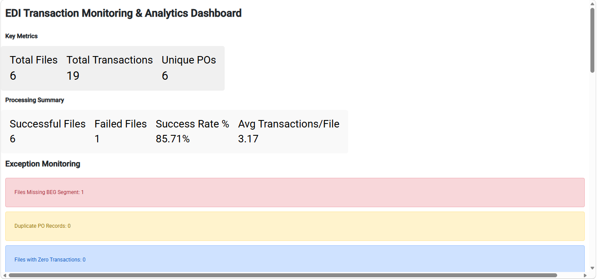
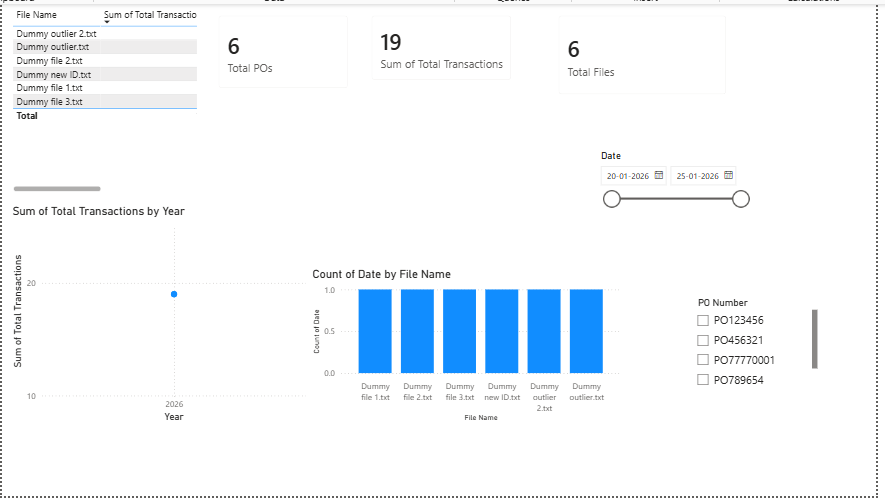

# EDI Operational Analytics Dashboard

## Project Overview
Designed and developed an EDI Operational Analytics Dashboard to automate the monitoring of EDI transactions, identify processing exceptions, and provide operational insights through interactive visualizations.

The solution processes raw EDI transaction files using Python, transforms the data into structured datasets, and presents key business metrics through Power BI dashboards.

## Business Problem
EDI operations teams process large volumes of transactions daily. Tracking transaction volumes, duplicate purchase orders, invalid files, and processing exceptions manually can be time-consuming and error-prone.

This project provides a centralized dashboard to improve visibility into EDI operations and support faster issue identification and decision-making.

## Key Metrics

- Total Transactions Processed
- Purchase Order Volume
- Duplicate Purchase Orders
- Invalid File Count
- Transaction Trends
- Exception Monitoring

## Features
- Automated EDI file parsing and data extraction
- Purchase Order (PO) analysis
- Duplicate PO detection
- Invalid file monitoring
- Transaction volume tracking
- KPI monitoring dashboard
- Interactive filtering and drill-down capabilities
- CSV export functionality
- Power BI reporting and visualization

## Technologies Used
- Python
- Pandas
- Panel
- Matplotlib
- Power BI

## Workflow
EDI Files → Python Processing → CSV Output → Power BI Dashboard

### Python Dashboard

 
### Power BI Dashboard

## Author
Tanaya Patil
